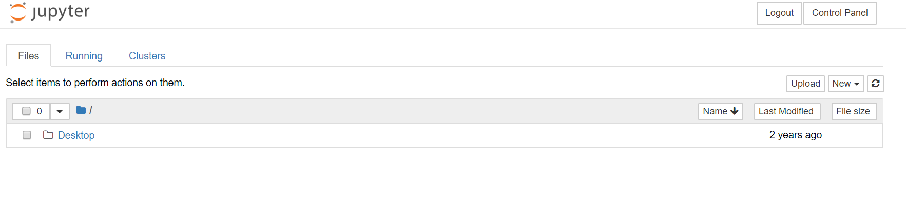

# Installation and Configuration of Hour of CI JupyterHub

## 1. Prerequisites

You need a Jetstream account with an XSEDE allocation.

## 2. Installing the littlest JupyterHub on JetStream 

Step 1. Log into [the Jetstream portal](https://use.jetstream-cloud.org/).     

Step 2. Select the **Ubuntu 18.04 Devel and Docker** image and launch.  

Step 3. In the dialog **Launch an Instance / Basic Options**, type your own **Instance Name** and select **m1.medium** (recommended) under **Instance Size**. Select a **Base Image Version** except 1.35 and 1.36, in which `jupyter_contrib_nbextensions` cannot be installed correctly. 

Step 4. Click **Advanced Options**, and then click **Create New Script**. 

In the new dialog box,
* under **Input Type**, select **Raw Text**;  
* under **Execution Strategy Type**, select **Run script on first boot**;  
* under **Deployment Type**, select **Wait for script to complete**.  

Copy the text below, and paste it into the **Raw Text** text box. Replace `<admin-user-name>` with the name of the first admin user for this JupyterHub.   
```bash
#!/bin/bash
curl https://raw.githubusercontent.com/jupyterhub/the-littlest-jupyterhub/master/bootstrap/bootstrap.py \
  | sudo python3 - \
    --admin <admin-user-name>
```

After that, Click **Save and Add Script** and then click **Continue to Launch** to finish configuring the advanced options.  

Step 5. Click **Launch Instance**, and your server is getting created. You can see the status on the instance dashboard.  When the status is Active and the progress bar become a solid green, your JupyterHub is ready for use.

Step 6. Copy the IP Address of your server and access it from a web browser. You will go to the JupyterHub login page. Use the admin username set in the deployment script, and set a password when first log in.  

Now, you can work with your JupyterHub.   



See more details on [Installing on Jetstream](https://tljh.jupyter.org/en/latest/install/jetstream.html).

## 3. Installing and Enabling Eextensions for All Users

Some [jupyter_contrib_nbextensions](https://github.com/ipython-contrib/jupyter_contrib_nbextensions) notebook extensions are used in Hour of CI to add functionality.

Here are the steps to install and enable the extensions.

Installing packages in the terminal of JupyterHub may do not work. Thus, we install packages outside JupyterHub. 

Step 1. Go to the project page on [the Jetstream portal](https://use.jetstream-cloud.org/), and click **Open Web Shell** on the right side.

Step 2. Since we are outside JupyterHub, we need to change PATH to access user environment outside first.
```shell
export PATH=/opt/tljh/user/bin:${PATH}
```

Step 3. Install the Python package
```shell
sudo env PATH=${PATH} conda install -c conda-forge jupyter_contrib_nbextensions
```

Note: When using sudo, the PATH environment variable is usually reset, for security reasons. Thus, we nned to specify the PATH.  
If the package cannot be installed successfully, choose another base image version when [installing the littlest JupyterHub on JetStream](#2-installing-the-littlest-JupyterHub-on-JetStream).

Step 4. Enable/Disable extensions   
After installing contributed extensions, you can enable the extensions you would like to use. The syntax for this is jupyter nbextension enable followed by the path to the desired extension’s main file. In Hour of CI, two extesions will be enabled: `init_cell` and `python-markdown`:
```shell
sudo env PATH=${PATH} jupyter nbextension enable init_cell/main --sys-prefix

sudo env PATH=${PATH} jupyter nbextension enable python-markdown/main --sys-prefix
```

You can see the enabled extensions in the list: 
```shell
jupyter nbextension list
```

To disable the extensions again, use
```shell
sudo env PATH=${PATH} jupyter nbextension disable init_cell/main --sys-prefix

sudo env PATH=${PATH} jupyter nbextension disable python-markdown/main --sys-prefix
```

Note: Don't use the Nbextensions tab (jupyter_nbextensions_configurator) to enable or configure the extensions. The changes using the Nbextensions tab will only apply to your account instead of user environments. In addition, a nbconfig directory will be created in your home folder and overwrite the file in the system

## 4. Installing Packages for All Users

The following packages are installed using **conda**: 
* [RISE](https://rise.readthedocs.io/en/maint-5.6/installation.html): turns jupyter notebooks into a live presentation.
* [pillow](https://pillow.readthedocs.io/en/stable/): adds image processing capabilities.
* [geopandas](https://geopandas.org/): extends pandas to allow spatial data types and operations.
* [shapely](https://shapely.readthedocs.io/en/stable/project.html): can be used for manipulation and analysis of geometric objects.
* [ipyleaflet](https://ipyleaflet.readthedocs.io/en/latest/): creates interactive maps or layers in the Jupyter Notebook. 
* [osmnx](https://osmnx.readthedocs.io/en/stable/index.html): lets you download spatial geometries and model, project, visualize, and analyze real-world street networks from OpenStreetMap’s APIs.
* [GDAL](): includes two libraries – GDAL for manipulating geospatial raster data and OGR for manipulating geospatial vector data.
* [mapclassify](https://pysal.org/mapclassify/): can be used for Choropleth map classification.
* [mplleaflet](https://github.com/jwass/mplleaflet): converts a matplotlib plot into a Leaflet web map. It can also embed the Leaflet map in an Jupyter notebook.
* [rasterio](https://rasterio.readthedocs.io/en/latest/): reads and writes GeoTIFF and other formats for raster datasets.

They can be installed using
```shell
sudo env PATH=${PATH} conda install -c conda-forge <package name>
```

For example,
```shell
sudo env PATH=${PATH} conda install -c conda-forge rise
```

Some packages are installed in other ways:

[mordecai](https://github.com/openeventdata/mordecai): perfoms full text geoparsing and event geocoding.
```shell
sudo env PATH=${PATH} pip install mordecai

sudo env PATH=${PATH} python -m spacy download en_core_web_lg
```

[ttf-mscorefonts-installer](): the installer for Microsoft TrueType core fonts which will fetch and install the fonts.
```shell
sudo env PATH=${PATH} apt install ttf-mscorefonts-installer
```

Note: If you want to install other packages, check their installation instructions and add `sudo env PATH=${PATH}` before the commands.

## 5. Other Configurations
You can use tljh-config to configure the Littlest JupyterHub.   

In Hour of CI, we try to shutdown the server after no activity for 20 minutes:
```shell
sudo tljh-config set NotebookApp.shutdown_no_activity_timeout 1200
```

Other timeout configurations:
```shell
sudo tljh-config set services.cull.timeout 3600

sudo tljh-config set services.cull.every 600
```

After modifying the configuration, you need to reload JupyterHub for it to take effect:
```shell
sudo tljh-config reload
```

You can go to [Configuring TLJH using tljh-config](http://tljh.jupyter.org/en/latest/topic/tljh-config.html#reloading-jupyterhub-to-apply-configuration) and see how to set other properties.


## 6. Adding Users
In the default authentication method, admin users can [add users in the admin page](https://tljh.jupyter.org/en/latest/install/jetstream.html#step-2-adding-more-users), and users use the assigned username choose a password when they first log in.   

## 7. Sharing Data

nbgitpuller is a Jupyter Notebook extension that helps distribute study materials / lab notebooks to students. Users of your JupyterHub can **click a nbgitpuller link** to fetch the latest version of materials from a git repo.

You can use an [application for nbgitpuller link generation](https://mybinder.org/v2/gh/jupyterhub/nbgitpuller/master?urlpath=apps/binder%2Flink_generator.ipynb).

See more details on [Distributing materials to users with nbgitpuller](https://tljh.jupyter.org/en/latest/howto/content/nbgitpuller.html).

Here is a link for a Hour of CI notebook demo: https://pilot.hourofci.org/hub/user-redirect/git-pull?repo=https%3A%2F%2Fgithub.com%2FIrisZhiweiYan%2Fhourofci-demo&subPath=geospatial-data%2Fgd-1.ipynb&app=notebook

## 8. Setting up Dynamic DNS

The IP address of your JupyterHub server will change if you suspend or stop the server, so a dynamic DNS is needed.

Step 1. Set up a Dynamic DNS synthetic record

Step 2. Sep up and configure a client program in your JupyterHub server, using the username and password generated in Step 1.  
DDclient is suggested to used. You need to install ddclient in your server:  
```shell
sudo apt install ddclient
```
Once the installation completes, a configuration wizard will automatically start. You can type anything randomly, because the configuration file will be edited manually.  

Open the configuration file after the wizard completes:
```shell
sudo nano /etc/ddclient.conf
```

Replace the content with the following: 
```shell
# /etc/ddclient.conf
protocol=dyndns2
use=web
server=domains.google.com
ssl=yes
login=generated_username
password=generated_password
your_resource.your_domain.tld
```

Remember to replace with your username and password, and domain name. 

Run the following code to detect your current IP address and update your DNS server:
```shell
sudo ddclient
```
You need to run ddclient each time when the IP address is updated, or you can configure it to check and update IP periodically.  

See more details on [Dynamic DNS](https://support.google.com/domains/answer/6147083?hl=en)


## 9. Enabling HTTPS

You may want to enable HTTPS to secure data communication. The Littlest JupyterHub provides the Let’s Encrypt method to set up HTTPS.  

Follow the commands on [Automatic HTTPS with Let’s Encrypt](http://tljh.jupyter.org/en/latest/howto/admin/https.html#automatic-https-with-let-s-encrypt)