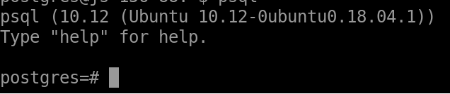

# Set Up for Database and Logging

## Introduction
There are many questions and interactive animations in Hour of CI lessons. Users need to answer the questions or play with the animations to learn the knowledge. We would like to record users’ answers/ interactions in our database. We use a restful API which will pass the lessons’ information and answers as parameters and call a function predefined in the database.
Installation and configuration of the server for logging. 

## Installing the Virtual Machine
We create a virtual machine on JetStream to serve our database and logging API. The steps are very similar to those for Installing the littlest JupyterHub, but we do not need to add a script.  

Step 1. You need a Jetstream account with an XSEDE allocation.  

Step 2. Log into the [Jetstream portal](https://use.jetstream-cloud.org/application/dashboard).  

Step 3. Select the Ubuntu 18.04 Devel and Docker image and launch.
Step 4. In the dialog Launch an Instance / Basic Options, type your own Instance Name and select m1.small (or larger) under Instance Size.   

Step 5. Click Launch Instance, and your virtual machine is getting created. You can see the status on the instance dashboard. When the status is Active and the progress bar becomes a solid green, your virtual machine is ready for use.  

Step 6. Set up Dynamic DNS  
Follow the steps in Setting up Dynamic DNS for JupyteHub but use a different domain name. Then we can use the domain name instead of the ip address when connecting to the servers in our virtual machine. 

## Installing and Configuring the PostgreSQL server  
We use PostgreSQL to serve our database, so we need to install PostgreSQL on our virtual machine first. After that we can use commands or pgAdmin to manage the database.  

Step 1. Go to the project page on the Jetstream portal, and click Open Web Shell on the right side.

Step 2. Install PostgreSQL  

```shell
sudo apt update
sudo apt install postgresql postgresql-contrib
```

Something like the following message will be shown:


Note: The port of PostgreSQL is 5432. Do not use this port if you install other applications.

Step 3. Verify the Installation
```shell
sudo -u postgres psql -c "SELECT version();"
```
If PostgreSQL is installed successfully, the version information will be shown.

Step 4. Access the database
The “postgres” user is created automatically when you install PostgreSQL. To log in to the PostgreSQL server, you need to switch to the user “postgres” first.
```shell
sudo su - postgres or  sudo -i -u postgres
```

Note: now you have switched to “postgres”, which does not have sudo privileges in your virtual machine. When you need to use sudo command in the following step, you need to switch back to the account with sudo privileges

Then you can access the prompt of the default database “postgres” using:  
```shell
psql
```



To exit the prompt, use `\q`.   

Note: Use `psql` can access the database with the same name as the user. Later, we will introduce how to access a different database.

Step 5. Create a superuser account
You can use the default superuser account “postgres” or create your own superuser accounts.
```shell
sudo -u postgres createuser --interactive
```

Type your own username and “y” for superuser:


Step 6. Create users
Use the same command to create an account for the regular users of Hour of CI lessons. All of the users will insert data into the database using this account.  


Step 7. Create a database

```shell
createdb <database name>
```

Connect to the database which has a different name from the user. For example, the new database is called `hourofci`:
```shell
psql -d hourofci
```

Now you can manage the database using SQL in the prompt:  

Step 8. Set password for all users (including your account) in the prompt  
```shell
hourofci=# ALTER USER <username> PASSWORD <password>;
```

Step 9. Server Configuration: Enable remote access to PostgreSQL server  

Before this step, this PostgreSQL server listens only on the local interface. Any connection from other addresses will be refused.  
 

We need to let it listen on all interfaces (0.0.0.0) so that users from anywhere can access the database (Question: do we need to restrict it to pilot.hourofci.org?). You can use `ALTER SYSTEM SET` in the prompt to do this: 
```shell
hourofci=# ALTER SYSTEM SET listen_addresses to '*';
```

 

Step 10. Server Configuration: accept remote connections
Open and edit the configuration file:
```shell
sudo vim /etc/postgresql/10/main/pg_hba.conf
```

Add the following lines at the end of the files:
```shell
# Accept remote connection
# User will be able to access only the hourofci database from all locations using a md5 password
host    hourofci		hourofciuser	    0.0.0.0/0	  md5
host    all			    <admin-user>		  0.0.0.0/0	  md5
```

Remember to restart the server after that
```shell
sudo /etc/init.d/postgresql restart
```

## Creating Tables and Functions in the Database
You can create tables, functions, and grants in the PostgreSQL prompt, but pgAdmin is recommended. pgAdmin is an Open Source administration and development platform for PostgreSQL. It provides a graphical interface where the creation, maintenance, use and visualization of database objects are simplified. 

Step 1. Download pgAdmin and connect to the PostgreSQL server


Step 2. Create a table from schema in the database

Can simply run the code in **Database_Creation.ipynb**, or run SQL in the query tool in pgAdmin.

Step 3. Create a function that insert data into the database

Finally, there are 2 main tables `loggingtable` and `loggingtable_tes`. The former is used for production and the latter is used for development/testing. Or you can just use the former one if you can distinguish between the users’ records and the developer’s records. The `logging` function insert data into `loggingtable` and  `logging2` inserts data into `loggingtable_test`.


## Developing a RESTful API for Logging
We build an API with Python and Flask. The virtual machine we create for the database will be used to serve Flask.

Step 1. Go to the project page on the Jetstream portal, and click Open Web Shell on the right side.

Step 2. Create a virtual environment
A virtual environment is used to manage the dependencies for our Flask API. Create a folder `logging` for API development and a `logging_venv` folder within:
```shell
sudo apt-get install python3-venv
mkdir logging
cd logging
python3 -m  venv logging_venv
```

Activate the environment:
```shell
. logging/logging_venv/bin/activate
```

Step 3. Install Flask and other related packages   
Flask provides a framework for developing web applications/ services in Python. Flask-RESTful is an extension for Flask that can help developers quickly build RESTful APIs (we also can only use Flask to build APIs). Another extension, Flask-CORS, can solve the AJAX cross-origin problem when we send requests from pilot.hourofci.org. gunicorn is used to serve Flask applications for production.
```shell
pip install Flask
pip install flask-restful
pip install flask_cors
pip install gunicorn
```
 
To connect the PostgreSQL database in the API, we need to install psycopg: 
```shell
pip install psycopg2-binary
```

Step 4. Design a API with Flask
See **houofciLog.py**

Step 5. Enable HTTPS
We need to obtain an HTTPS certificate from Let's Encrypt. First, install a tool `certbot` for this:
```shell
sudo apt-get install software-properties-common
sudo add-apt-repository ppa:certbot/certbot
sudo apt-get update
sudo apt-get install certbot
```

Then, run Certbot to get a certificate (make sure that the web server is not currently running):
```shell
sudo certbot certonly --standalone
```

If certbot is able to verify the domain, the certificate and chain will saved at as `/etc/letsencrypt/live/example.com/fullchain.pem` and the private key as `/etc/letsencrypt/live/example.com/privkey.pem`


The certificate will expire in 90 days. To renew the certificates, use:
```shell
sudo certbot renew
```

Note: Need to restart the web server to pick up the renewed certificates.

If we want to renew the certificates automatically before they expire (recommended), use the following command. We will not need to run Certbot again, unless configuration is changed
```shell
sudo certbot renew --dry-run
```

To view the certificate, use:
```shell
sudo certbot certificates
```

See Certbot Instructions or User Guide for more information about installing and running certbot.


Step 6. Run the API on Gunicorn
Remember that the packages are installed in a virtual environment. To use `gunicorn`, activate the environment first.
```shell
. logging/logging_venv/bin/activate
```

If we do NOT use HTTPS, we can run the API simply:
```shell
gunicorn -w4 -b 0.0.0.0:4000 hourofciLog:app
```

Since we have enabled HTTPS, we need to install the certificate when running the application. Switch to the root user and then enter the certificate files mentioned above:
```shell
su
gunicorn --certfile /etc/letsencrypt/live/check.hourofci.org/fullchain.pem --keyfile /etc/letsencrypt/live/check.hourofci.org/privkey.pem -w4 -b 0.0.0.0:4000 hourofciLog:app
```

[Image]

If want to stop the service, use:
```shell
sudo pkill gunicorn
```

To check the process, use 
```shell
ps ax|grep gunicorn
```

Now we can send a request via url:
https://check.hourofci.org:4000/<user_agent>/<lesson>/<lesson_level>/<question>/<answer>
